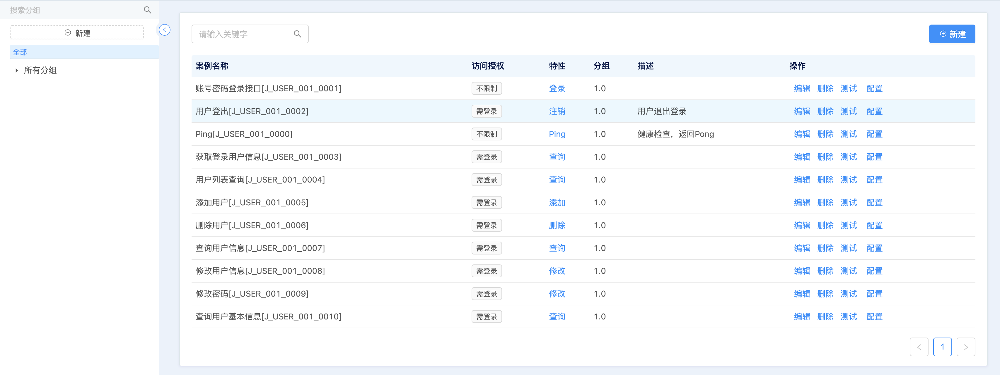

# 产品概述
CCP Server（Code Cloud Platform）是一个低代码开发平台的产品，以`高效率`，`低成本`为目的而研发的一款产品，助力企业项目的快速开发。企业可以基于CCP Server提供的低代码能力快速构建不同应用，以满足企业的业务需求。在开发之前，我们希望您能通过该文档快速了解CCP Server的相关逻辑。

开发流程

## 接口管理
提供接口管理功能，如创建，删除，编辑，设计等功能。

接口管理列表

接口设计

## 测试案例管理
提供接口相关的测试数据管理。

测试数据管理

测试日志管理