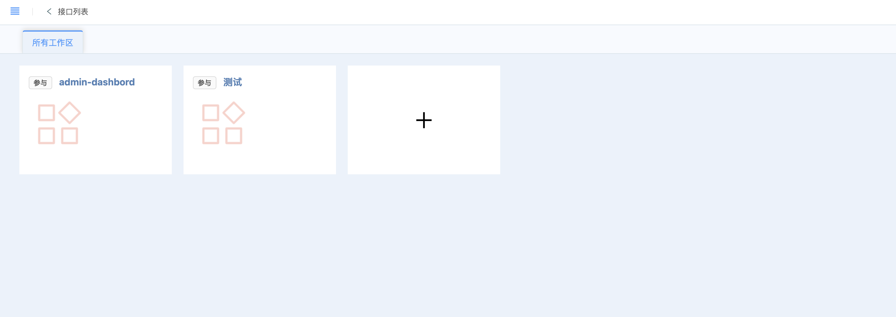
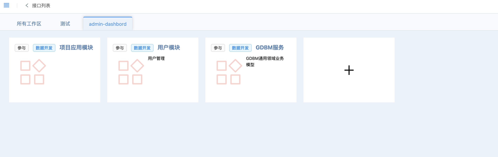
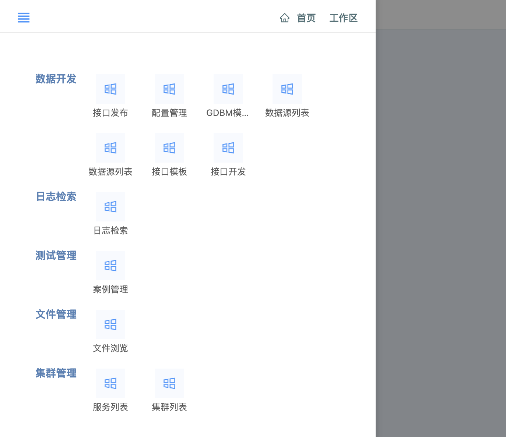
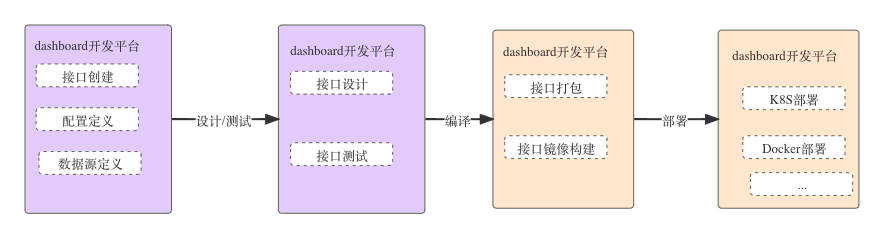
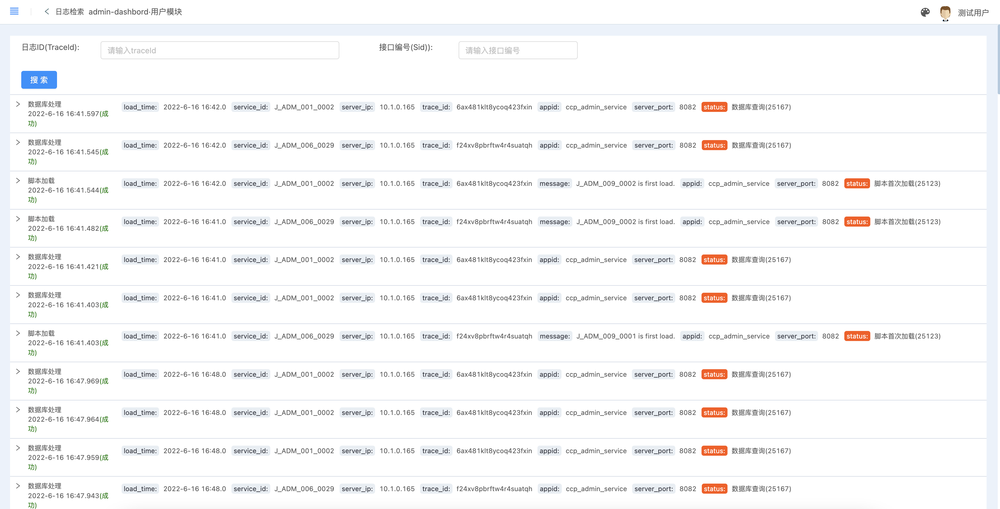
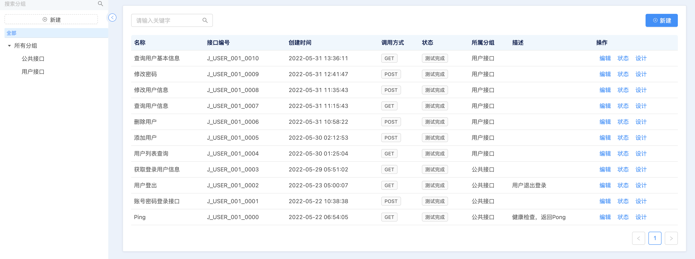
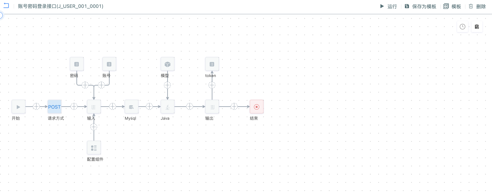
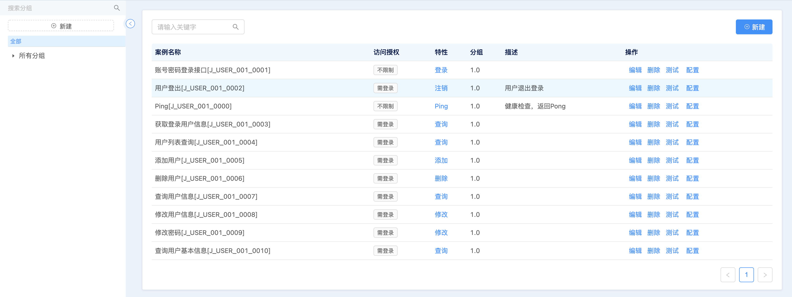
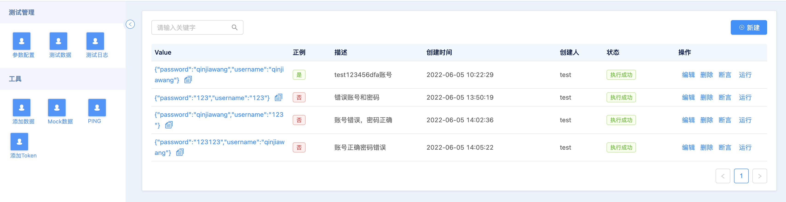
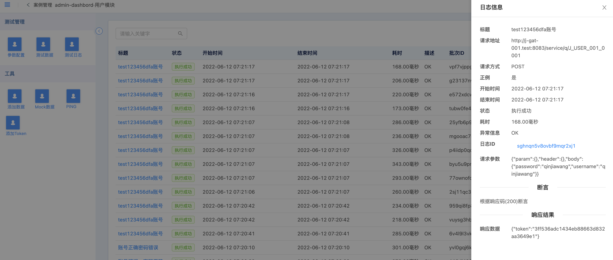

# 介绍
CCP-Server是一个低代码开发平台。提供强大的接口开发逻辑，支持项目中常见接口的逻辑编排实现。

## 发布版本
|             资源名              | 时间 |
|:----------------------------:| :----: |
|             1.0           | 敬请期待  |

### 特点

* 高性能
* 低代码
* 多协议支持（Http，GRPC）
* 微服务，单机一体
* 接口编排
* 多数据源支持
* 插件扩展
* 接口文档自动生成
* 提供Dashboard交互面板
  

### 快速了解

工作区管理

菜单列表

开发流程

日志管理

## 接口管理
提供接口管理功能，如创建，删除，编辑，设计等功能。

接口管理列表

接口设计

## 测试案例管理
提供接口相关的测试数据管理。

测试数据管理

测试日志管理